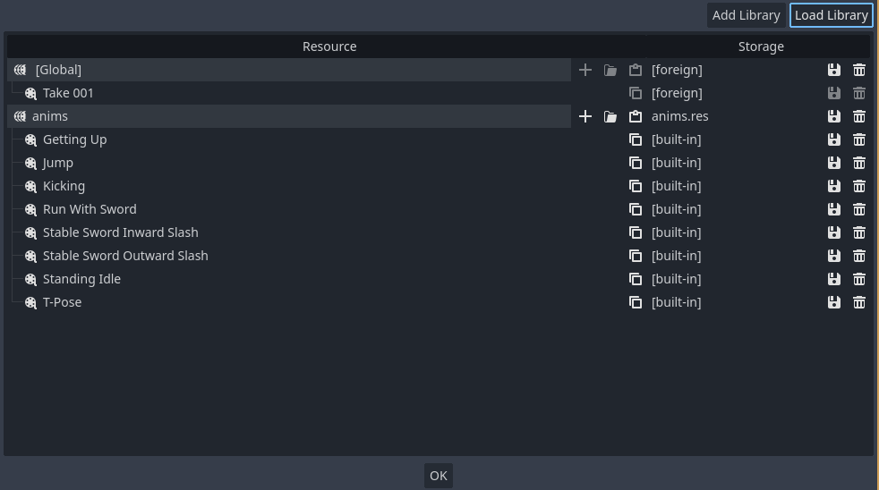
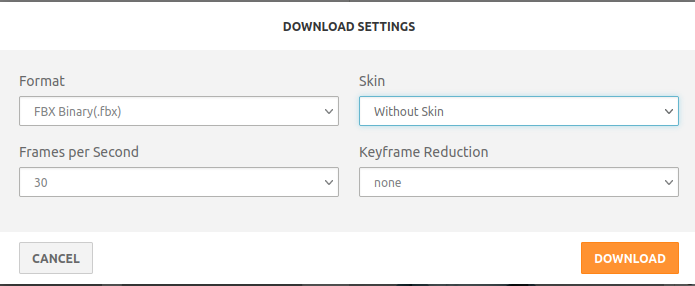

# Godot make animation library from mixamo

Convert a set of mixamo animations to an animation library usable in godot 4. 

## Requirements

You must have the following binaries in your path.

- blender
- godot 4

## Usage

```shell
git clone godot-lib-export
alias gdlib="/path/to/godot-lib-export/gd_make_lib.sh /path/to/Ybot.fbx"
gdlib "/my/animation/dir" "myLibrary.res"
```

## Using retargeting to use your library

Add the generated .res file to your godot project.

Import any rigged character.

Generate a humanoid Skeleton for this character.


If the dots are green, it means that godot heuristics correctly mapped your skeleton.

If some dots are red, you might have to do some manual tweaks.

Create a new inherited scene from the imported character and select the `AnimationPlayer` node.

In the animation tab click on `Animations > Manage Animations`.

In the new window, click on `Load library` and select your animation library.



## Downloading from mixamo

### Character

Any character can be used, but I suggest you just get the YBot.


### Animations

Download individual animations from mixamo.

Make sure you have the same character selected that you previously downloaded. 

Suggestions:
 - Tweak any animation parameters you want
   - ie, shorten lengthy animations
   - Use "in place" if you don't want to deal with root motion
   - Use mirror if necessary
     - You can make a right handed character left-handed
     - You can generate an animation in two directions (ie, "strafe-left" and "strafe-right") 
 - Download the animations without skin 



Put all the animation fbx files in a directory.

Verify the names are matching what you want to have in your library.

You can suffix animations with "-loop" if you want them to loop (a walk cycle, for example).

## How it works


### First script: blender to generate a glb

It uses a python script to make blender:

- Import the character
- Add the TPose animation as an NLA track
- For each animation
  - import it
  - copy its animation to the character as an NLA track with the file name as the animation name
  - delete the animation from the scene
- export the scene as a glb

### Second script: uses godot to generate the library from the glb

Then it launches godot in headless mode to generate the library.
To do that, we have a "template" godot project with a `anims.glb.import` file containing:
- the parameters used for the import (type=animation library, 30fps, etc.).
- a humanoid skeleton matching the mixamo rig

We place the glb next to the `anims.glb.import` file. 

When godot launches, it imports the file in `.godot/imported`.

We find the `.res` file that has been generated and copy it where the user wants it.

You can use these scripts individually if you want.

For example, you could use the blender script to generate the glb file
and then import that in godot, changing its type to "animation library" in the import tab.
